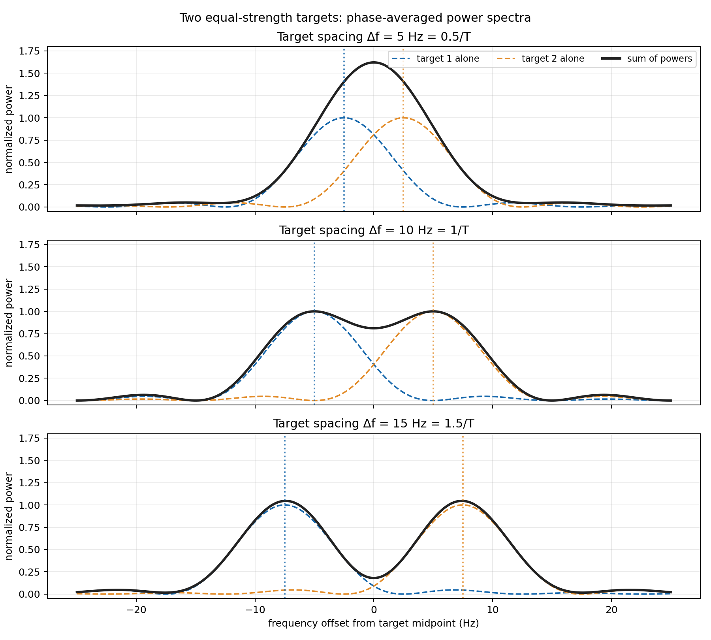
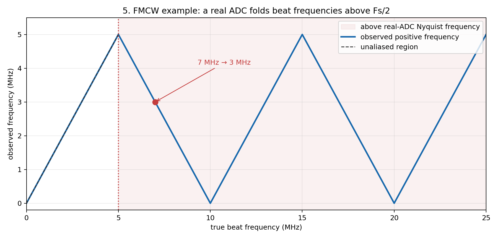

# FMCW 雷达信号处理图解

这个仓库用可运行的 Python 脚本，解释 FMCW 雷达算法中常见的采样和分辨率问题。每个脚本运行后都会在对应文件夹生成 PNG 图。

## 运行

需要 Python 3.11 或兼容版本：

```bash
python -m pip install -r requirements.txt
python explain_sinc_resolution.py
python explain_nyquist.py
```

Windows 上也可以用 `py -3.11` 代替 `python`。

## 距离分辨率与 sinc 谱

运行 [`explain_sinc_resolution.py`](explain_sinc_resolution.py) 生成 [`plots/`](plots/) 中的四张图：

1. 矩形观测窗如何截取单频信号。
2. 有限时长信号的 sinc 形谱，以及中心到第一个零点的间隔 `1/T`。
3. 观测时间翻倍后，谱峰宽度如何变化。
4. 两个目标的间隔为 `0.5/T`、`1/T`、`1.5/T` 时，平均功率谱如何变化。

对静止目标的理想 FMCW 模型，调频斜率 `S = B/T`、拍频 `f_b = 2SR/c`，因此名义距离分辨率为 `ΔR = c/(2B)`。双目标图使用**相位平均功率谱**；单次相干回波的谱形还受目标相对相位影响。



## 奈奎斯特采样与混叠

运行 [`explain_nyquist.py`](explain_nyquist.py) 生成 [`nyquist_plots/`](nyquist_plots/) 中的五张图：

1. 足够快的采样和 sinc 重建。
2. 3 Hz 与 7 Hz 信号在 10 Hz 采样下得到相同样本。
3. 采样产生的频谱副本及其重叠。
4. 在 `Fs = 2f` 边界，正弦波的采样点可能全部为零。
5. 实值 ADC 中，FMCW 拍频超过 `Fs/2` 后如何折叠。

这里的采样定理针对最高频率为 `fmax` 的实值低通信号，避免混叠的条件是 `Fs > 2fmax`。采样率 `Fs` 决定无混叠的频率范围；观测时间 `T` 决定常规频谱的名义频率分辨尺度 `1/T`。



## FMCW 和 DDMA 虚构样例

本仓库仅包含独立构造的教学配置，不代表任何实际设备。

- [虚构配置](configs/radar_cfg_example.h)
- [FMCW 脚本](simulate_highspeed_wave.py)与[学习指南](HIGHSPEED_GUIDE.md)
- [DDMA 脚本](simulate_ddma.py)与[学习指南](DDMA_GUIDE.md)

DDMA 的二维 FFT 保持原始顺序，图中使用 Range Bin / Doppler Bin。运行方式为 python simulate_highspeed_wave.py 和 python simulate_ddma.py。

真实配置应放在仓库外，通过 --config 指定；脚本拒绝将外部配置生成的结果写入本仓库。公开的配置、说明、报告和配图均使用虚构参数。
