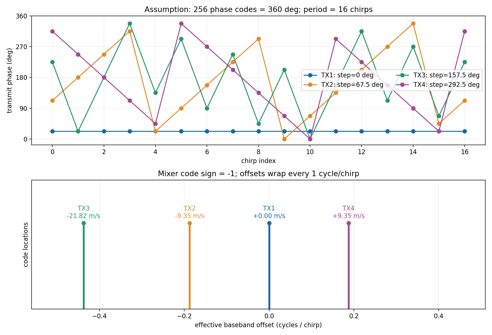
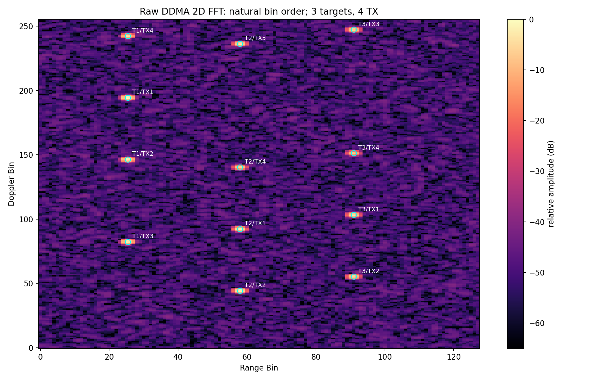
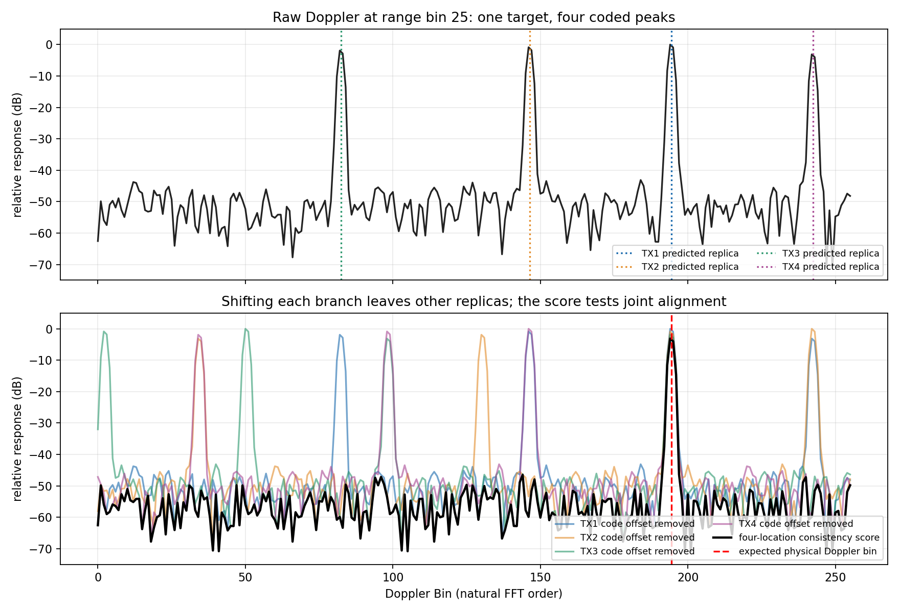
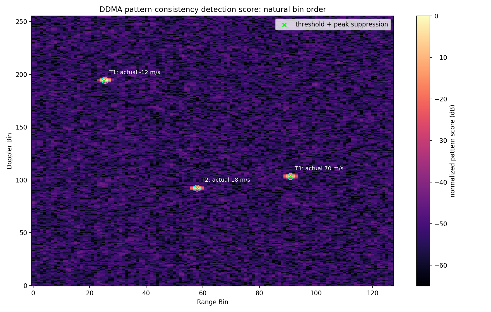
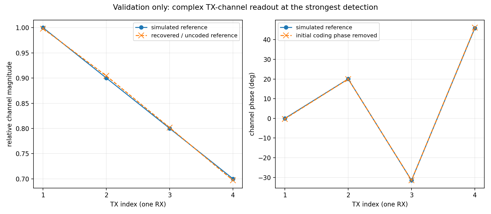

# DDMA 本次结果

4TX 同时发射、1RX 等效接收；仓库自带波形和相位码均为虚构教学值。

## 相位码与频移

| TX | 初相位 ° | 步进 ° | 有效 FFT 搬移格点 | 等效速度搬移 m/s |
|---|---:|---:|---:|---:|
| TX1 | 22.5000 | 0 | 0 | 0.0000 |
| TX2 | 112.5000 | 67.5 | -48 | -9.3500 |
| TX3 | 225.0000 | 157.5 | -112 | -21.8168 |
| TX4 | 315.0000 | 292.5 | 48 | 9.3500 |

## 检测读数

| 编号 | Range Bin | Doppler Bin | 表观距离 m | PRF 周期内速度 m/s | 相对图样得分 dB |
|---|---:|---:|---:|---:|---:|
| 1 | 25 | 194 | 19.518 | -12.077 | 0.00 |
| 2 | 58 | 92 | 45.281 | 17.921 | -1.29 |
| 3 | 91 | 103 | 71.045 | 20.064 | -3.73 |

检测使用图样相对阈值，不是硬件 CFAR；读数不依赖真值目标数。完整说明见项目中的 DDMA_GUIDE.md。

