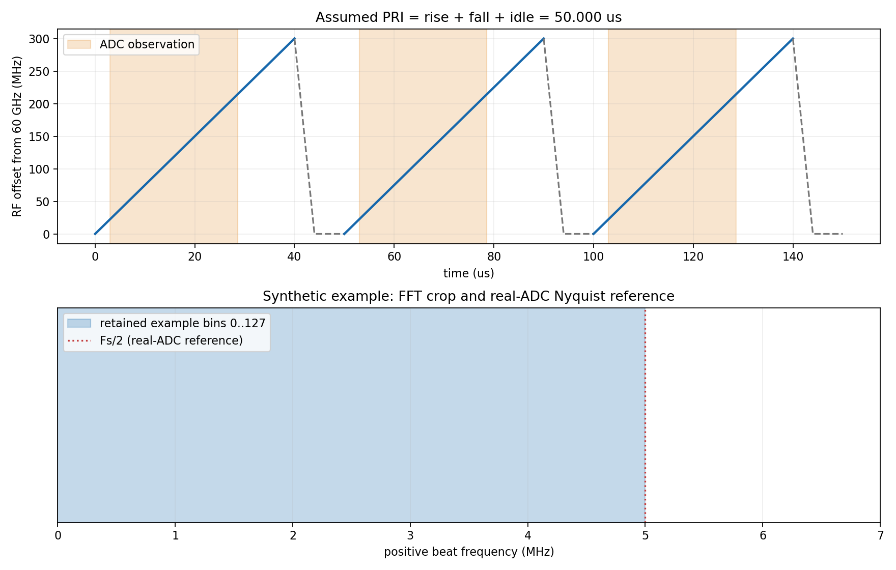
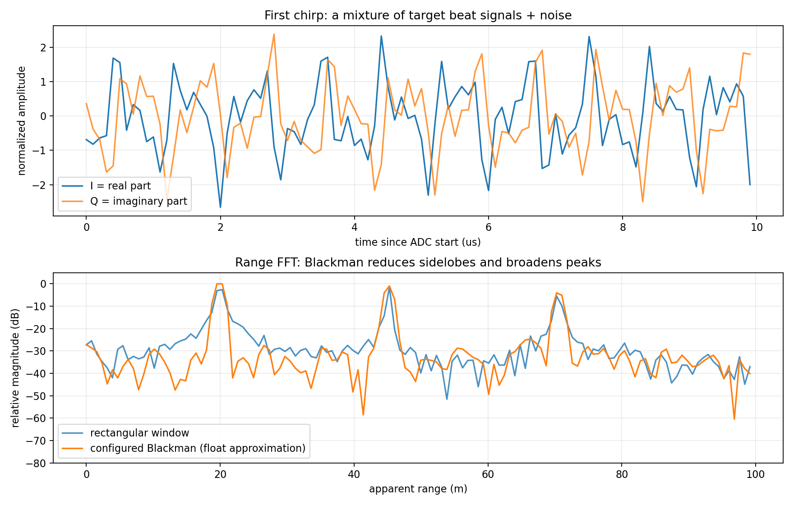
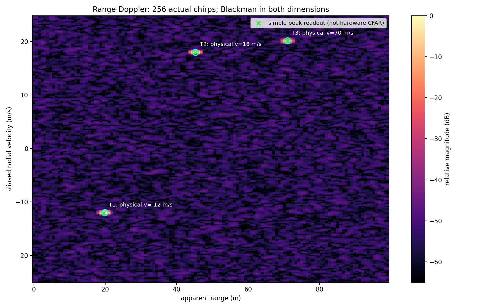
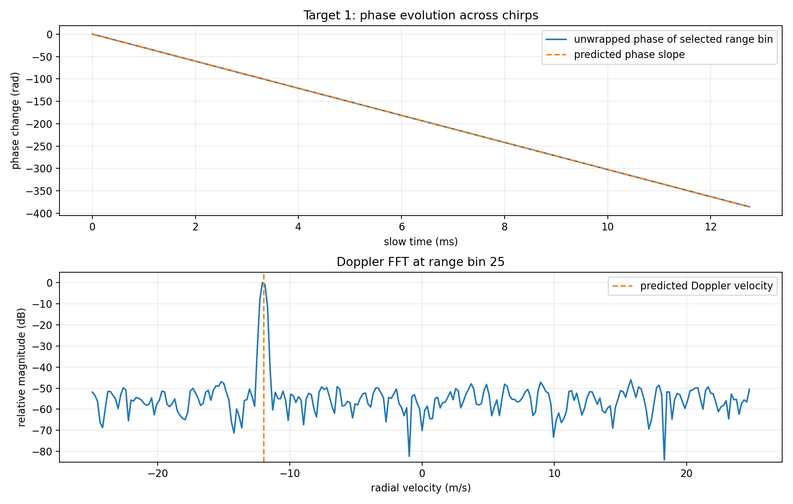
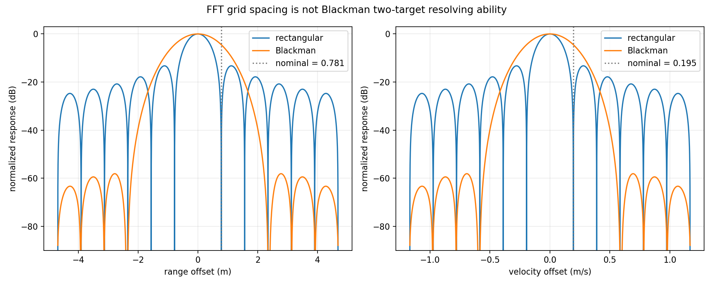

# 本次仿真结果

常规 FMCW 单通道教学仿真。仓库自带配置使用完全虚构的参数。

## 参数换算

| 参数 | 数值 |
|---|---:|
| chirp_interval_us_assumed | 50 |
| slope_MHz_per_us | 7.5 |
| adc_observation_us | 25.6 |
| observed_bandwidth_MHz | 192 |
| full_sweep_nominal_range_resolution_m | 0.499654097 |
| observed_nominal_range_resolution_m | 0.780709526 |
| range_grid_m | 0.780709526 |
| last_retained_range_bin_m | 99.1501098 |
| reference_RF_GHz | 60.1185 |
| assumed_actual_chirps | 256 |
| configured_doppler_fft | 256 |
| used_doppler_fft | 256 |
| coherent_time_ms_assumed | 12.8 |
| nominal_velocity_resolution_m_s | 0.194792666 |
| velocity_grid_m_s | 0.194792666 |
| max_signed_velocity_abs_m_s | 24.9334612 |

## 场景与预测

| 目标 | 初始距离 m | 真实速度 m/s | 预测表观距离 m | 预测混叠速度 m/s |
|---|---:|---:|---:|---:|
| T1 | 20 | -12 | 19.827 | -12.000 |
| T2 | 45 | 18 | 45.259 | 17.999 |
| T3 | 70 | 70 | 71.008 | 20.129 |

表观距离含 Doppler 耦合和 CPI 内运动；速度坐标采用 ADC 中心 RF 波长。
峰值读数只有 FFT 格点精度，采用简单峰值选取；不等同于配置的硬件 CFAR。

## 阅读图片

## 模型约定

- chirp_bandwidth interpreted as MHz; rise/fall/idle/ADC delay interpreted as us.
- PRI assumed to be rise + fall + idle, with no extra gaps inside this CPI.
- Actual chirps explicitly selected by --chirps; FFT length is not evidence of actual chirp count.
- A coherent, dechirped complex equivalent channel is simulated. Actual ADC format is unspecified.
- The bundled configuration is entirely synthetic and contains no physical device settings.
- This single-channel model does not apply the example TX phase codes; use simulate_ddma.py for coding.
- The CPI length is selected for the simulation; no hardware frame schedule is inferred.
- num_rangebin interpreted as keeping bins 0..127.
- Blackman windows use numpy symmetric floating coefficients, not hardware quantized tables.
- RF filters, gains, fixed-point scaling, CFAR/NVE and DOA are not emulated.
- Targets have fixed relative amplitudes, constant radial speeds, no acceleration or multipath.
